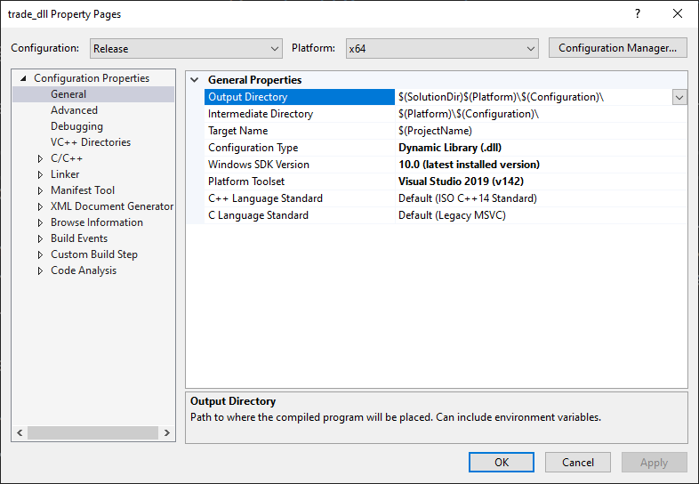

# changes from the original:
- added a window to configure when resources should be bought / sold
- added functionality to auto sell resources
# notes:
- should be built int 32 bit / 86x to work (the picture suggests 64 bit, which should not work)
- injector that can be used: https://github.com/adamhlt/DLL-Injector
- when using autobuy/sell the ingame function of the game is used to do so. This comes with some "issues", when choosing 200 as a threshold the game will autosell 50 at once putting the new total at 150 because that is how the market works. This is less of a problem when dealing with lower values as the auto sell then uses lower amounts. Just something to keep in mind. 

# stronghold_autosell
This mod adds adjustable automatic selling of resources in Stronghold Crusader game.
It is compatibile with:
* [Stronghold Crusader HD](https://fireflyworlds.com/games/strongholdcrusader/)
* [Stronghold Crusader Unofficial Crusader Patch](https://github.com/UnofficialCrusaderPatch/UnofficialCrusaderPatch)
## Build settings
note: this should be 32 bit / 86x to work.

## How to build
1. Build project in release mode using Visual Studio.
Resulting file is Release//trade_dll.dll
## How to use
1. Inject resulting file `Release//trade_dll.dll` into Stronghold Crusader process using any dll injector.
You need inject dll everytime you run the game.
## How it works
1. Automatically sells resources if their level is above a specified value(default 200).
1. Automatically buy resources until reaching the specified value (default 0, not buying anything). 
1. threshold for each resource can be adjusted in the Resource Settings window added by this project.
1. Detects if the market is built and prohibits trading without it.
